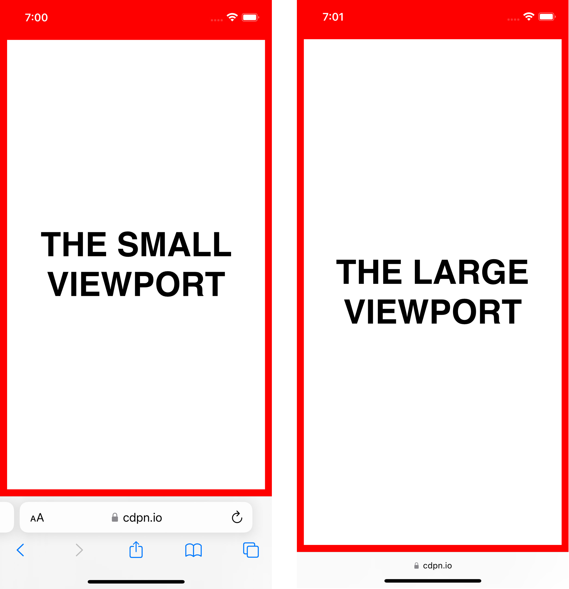

Viewport units like `vw`, `vh`, `vmin`, and `vmax` have had great [browser support](https://caniuse.com/viewport-units) over the years. While most of these units work just fine, there is one particular thing about the viewport unit viewport-height i.e., `vh`, that hasn't quite worked at the required _level of expectation_ for the community. 

On mobile, the viewport height changes depending on whether or not certain browser control elements are visible, and `100vh` doesn't always match the height of the viewport. 

### Meet `svw`, `lvh`, and `dvh` css units

<!--truncate-->

On mobile we now have a css unit for the browser in small viewport state and the large viewport state. According to the spec, the small viewport is the viewport size with browser interface (the url/address bar etc.) being fully visible. And long view is when the browser has been dynamically retracted to a minimum. See figure below:

The problem with `100vh` on mobile is that some of the UX/UI of a "full screen" web-app tends to fall below the browser interface, when the viewport state is small (or the browser is in expanded state). Since 2015,  `100vh` has usually matched the larger viewport. 

With CSS @level 4 You can use svh for the small viewport and lvh for the large viewport.

https://caniuse.com/viewport-unit-variants

div {
  height: 100svh;
  /* See result in the first screenshot */
}
div {
  height: 100lvh;
  /* See result in the second screenshot */
}

That's great, but depending on if and how the user interacts with the page, they might sometimes see the large viewport and sometimes the small viewport. Setting the height to either unit probably isn't what you want because the height changes dynamically. Instead, you want to use the third new unit dvh, which dynamically either matches svh or lvh.

div {
  height: 100dvh;
}
comparisson of vh, lvh, svh, and dvh on a small and large viewport

### Intrinsic Determinism  

:::info 
:::

