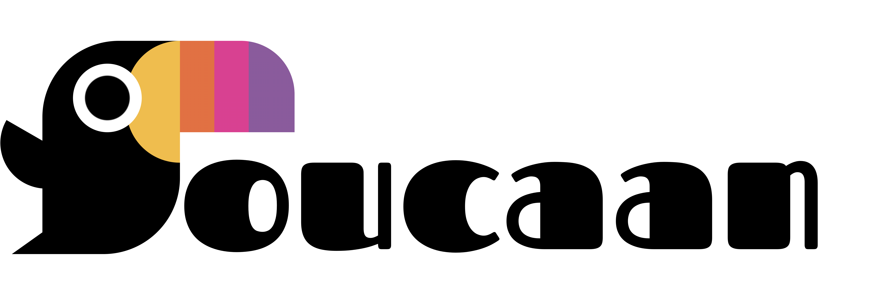

---
_This article was originally featured on the [The Bubblin Blog](https://bubblin.io/scrolls/blog)._

---

# Introduction

Welcome to web design in 2023.

While the world continues to race towards space age and AI (LLM) driven publishing, we can turn our gaze towards the other more pressing frontier of technology that is relevant to us: 

CSS. 🙂

<!--truncate-->

Let's revisit how we could use the newest and the oldest powers of css to style modern web applications. In this post, we will start from the basics of a webpage, i.e., HTML & CSS, and develop a [new, more strategic, intelligent, fresh, and a more maintainable approach](../2022-08-10-intrinsic-web-design/) to writing css from the ground up.

Heads up: Our new framework will be created from scratch and will _not_ follow the aging principles of responsive design. 

I have named our new css framework [Toucaan](https://toucaan.com), and you can join me on the journey of building it together. The complete code of this project is available on its [official repositories](https://github.com/Toucaan) on GitHub, along with a noddy Toucan logo that I designed using css.



# Toucaan–The Tropical CSS Framework.

Qualitatively speaking, Toucaan intends to weed out all the unwanted
css that a framework no longer needs. It is a deep dive into the available css standards of the day to discover new and valuable patterns
according to [the landscape of new web](https://bubblin.io/scrolls/blog/the-new-landscape-of-the-web) today.

Who knows, we might even identify a few industry-wide anti-patterns in the process, and we can address those with some new ideas as we go about building Toucaan ground up.

:::info Official Handbook 
The latest [official handbook](https://bubblin.io/book/the-toucaan-framework-by-marvin-danig#frontmatter) containing some of the more profound ideas and experiments that went into building Toucaan is out!
:::


### Why call it Toucaan?

Well, quite simply because I owned the pretty domain name.

#### Cliché"

Besides, Toucan is a beautiful bird. This aggressive little arboreal ramphastidae symbolizes both beauty and strength. We will base our css framework on this highly social and resilient bird to implement a styling stricture that will cover all the wilderness of devices on the web. 

Occasionally—though rarely—we may even spar with other css frameworks using our "colorful, mean and oversized" bill. Therefore—say hello to **Toucaan**—the tropical css framework for the web.

> 👉 CSS may be hard… but if Toucaan—you can too!


## Existing Frameworks and Design Philosophy

With Toucaan, we will revisit every industry-wide design principle in existence today. We will test our ideas out in the open. No trick or technique, whether old or new, is off the table, but we will undoubtedly avoid using hacks. There are a few other rules that Toucaan will adhere to, which are described [here](https://github.com/Toucaan/toucaan.research/blob/master/RULES.md).

Now there are a lot of well-established css frameworks out there like Bootstrap, Bulma, Foundation, Tailwind, and a bunch of strategies like the BEM, OOCSS, or SMACSS (and others) to organize our application code, but we will not try to imitate or wrestle with any of those. 

We will instead start Toucaan on a blank slate so that we do not take away most of what these tools have to offer, but we also end up with something more than exists. 

Let's begin.

# The New Landscape of The Web

Before we write our first line of code, let us look at the variety of devices that are a part of the web today. There are many subtle differences between each, starting from device capability to aspect ratio, from browser support to potential accessibility situations, and of course, there is a constant flux of change in css standard itself. 

It is essential to understand what the new landscape of the web looks like today and prepare for what we are up against with the new framework. Here are some of the devices that sport a modern web browser:


There is the Apple Watch with a webkit browser, and the iPhones are available in numerous sizes instead of just the one model that Apple used to promote earlier. There are iPads in multiple sizes, with an independent OS, a slew of Android phones and tablets of different form factors, and desktops, laptops, and touchscreen tablet PCs. 

Several EVs, like the Tesla Model 3, also sport a web browser under a touch screen. There are intelligent televisions like the LG OLED TV series with a solid stock Chromium-based web browser. Samsung came out with a foldable phone recently, and Microsoft outed a foldable Surface tablet, and we could go on and on like this forever. It is never-ending! 


One shouldn't forget about the low-powered devices on the budget end of the market as well. Phones like the Nokia 2.2 on Android (with A53 core) or similar are top-rated in their segment.

Given the diversity of devices and the scale of connectivity today, it is safe to assume that the range of devices available today is on a **linear continuum of screen size and form factor**; that the slate of glass or the touch screen is practically resizable freely just like the browser itself.

# The First Issue of Older CSS Frameworks

The web is enormous now, and it is undoubtedly much harder to scale apps between the lowest and the highest options available today. Notice that we are not even talking about vendor inconsistencies at this point. 

The range of hardware itself is large enough to void the very first assumption made by nearly all the major frameworks:

> **Hardcoded breakpoints using device width.**.

Voila, and now we have our first anti-pattern to go after! ( ͡° ͜ʖ ͡°)


### MQs with hardcoded width breakpoints.

Breakpoints are hardcoded on Tailwind css like this [[1](https://tailwindcss.com/docs/theme#screens), [2](https://tailwindcss.com/docs/breakpoints/)], for example.

```javascript
// tailwind.config.js
module.exports = {
  theme: {
    screens: {
      'sm': '640px', // Translates to hardcoded break-points in media queries.
      'md': '768px',
      'lg': '1024px',
      'xl': '1280px',
    }
  }
}
```

On Bulma, like so [[1](https://github.com/jgthms/bulma/blob/768ce95d6976a14b526d41024348d8f9692817e9/css/bulma.css#L1882)]:

```css
/* Bulma: */

@media screen and (max-width: 768px) { /* Some style classes & rules here. */ }

@media screen and (min-width: 769px), print { /* Same class names but different value-props here. */ }

@media screen and (max-width: 1023px) { /* Repeat the class names but with slightly larger value-props… */ }

@media screen and (min-width: 1024px) { /* Again repeat the class names but with even larger value-props…  */ }

@media screen and (min-width: 1216px) { /* Dang!, again.*/ }

@media screen and (min-width: 1408px) { /* Meh. */ }
```
And so on. As you can see, these MQ breakpoints are hard-coded values of screen width along which we split and silo the application's css. But there is a problem with this approach. Screen width varies greatly, from an Apple Watch, with sub-inch screen width, to a desktop or even a large television monitor with a width measured in feet. And then, for each silo, we repeat the css classes with only slightly different property values to _manually_ tie the page together. 

Even typography and spacing need scaling according to the silo in play.

#### Example off of Tailwind: 

```css
+mobile
  +typography-size('mobile')

+tablet
  +typography-size('tablet')

+touch
  +typography-size('touch')

+desktop
  +typography-size('desktop')

+widescreen
  +typography-size('widescreen')

+fullhd
  +typography-size('fullhd')
```

Every existing css framework follows this pattern. Every time a new device or phone with a higher resolution is rolled out, a new breakpoint is added to the framework. 

The question is: How many breakpoints will cover everything on the web today? And at what point will there be all too many? 

The web before the iPhone was desktop-only. It was a simple time then. With the rise of smartphones, the web slowly percolated into our lives in the shape of _the mobile web_, and in the process, we were led to this tunnel vision of using width-based breakpoints _only_. 

Width-based MQ approach worked great initially, switching the layout between the desktop and the mobile web only, but now with so many devices and form factors to serve, we need a new strategy. 

Hardcoded screen width MQs are an anti-pattern. While it would be nice to continue doing what we have been doing for years with it, deep inside, we all know that this simplistic approach does not scale. We should do away with this anti-pattern first. But is there a better way? 

In the next chapter, we'll discuss that with [Orientation Querying](../2023-02-28-orientation-switch-media-query/).


---

#### Credits:

Super thankful to [Sonica Arora](https://bubblin.io/sonica), Abigail Rennmeyer, Varun Singh, and <a rel= "nofollow noopener noreferrer" href=" https://nilesh.trivedi.pw/">Nilesh Trivedi</a> for helping me review this post for accuracy.


