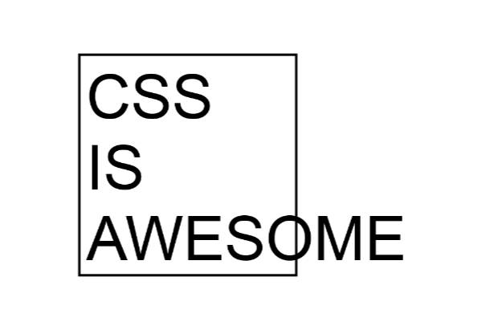

# Intrinsic Typography.

Scaling the digital type across mediums has always been a difficult problem. In this post, we will talk about an **intrinsically scaling typographic system** that we have discovered while building our [css framework](https://toucaan.com). 

As you'll see, this new system resolves most, if not all, of the challenges faced by a web developer. Let's start by solving this meme first: 



<!--truncate-->

### CSS IS AWESOME!

We'll prevent the overflow and scale the type dynamically according to the dimensions of the element.
Consider the following HTML:

```html
<div class="box">
  <p>CSS</p>
  <p>is</p>
  <p>awesome.</p>
</div>
```

I didn't have to use three separate `p` tags, but it offered additional control, so I just went with it. 

Now we can start applying the styles like so:

```css
@media only screen and (orientation: portrait) {
  :root {
    --vmin: calc(100vw/100);
  }
}
@media only screen and (orientation: landscape) {
  :root {
    --vmin: calc(100vh/100);    
  }
}
:root {
  --vmin: 1vmin;
}
```
From the code above, you can make out that it is our [Orientation Query](./orientation-querying-with-switch-media-query), and it demonstrates the mathematical relationship between the `vmin` and `vw`/`vh` units. `vmin` continuously points to the shorter side of the rectangular screen no matter what the orientation of viewing is. 

### Adopting the `vmin.`

From the code above, we can draw the following two axioms:

> **1st axiom:** 
>  - `100vh` in landscape mode = `100vw` in portrait mode. 

> **2nd axiom:** 
>  - `vmin` is **always** the shorter side of the rectangle. 

#### The Test of Element Squarish-ness.
The first axiom is very simple. `vw` and `vh` units are interrelated and can be swapped easily according to viewport orientation. One can say that device orientation is _intrinsic_ to viewport units.

The second axiom informs that a typographic unit based on the shorter side of the viewport has the lowest variability or delta upon resizing. On the desktop, as the browser window is resized we reach a point where the rectangular orientation switches from landscape to portrait; this is the point, the point of a square viewport, where the `vmin` unit flips from referring to the value of `vh` instead of `vw` since `vh` becomes the smaller of the two.

And `vmin` continues to change smoothly with an minimum absolute change reflected in its value. Of course, the `vmax` unit does the opposite, since it reflects the maximum possible change in the unit value of the resized rectangle.

Returning to the meme problem, we know the box around the text is square. This means that its sides are equal. Also, remember—in the world of resizable rectangles, a square is that geometrical point of inflection where the viewport orientation flips. 


```css 
*, *:after, *:before {
  box-sizing: border-box;
  margin: 0;
  padding: 0;
}

@media only screen and (orientation: portrait) {
  :root {
    --vmin: calc(100vw/100);
  }
}

@media only screen and (orientation: landscape) {
  :root {
    --vmin: calc(100vh/100);    /* 100vh of landscape === 100vw of portrait. */
  }
}
:root {
  --vmin: 1vmin;
  --side: calc(50 * var(--vmin)); /* dimensions of the square. */
  --border: calc(2 * var(--vmin)) solid black;  /* Outline for the square. */
}

.box {
  width: var(--side);     
  height: var(--side);
  border: var(--border);
  … 
}
```

This html and css will paint an empty square box on the page with a thick black border, just as it is on the meme.

### Scoping the Font Size & Line Height.

Now let's apply an _intrinsic_ font-size and line-height to the text within the box. To do so, we introduce two new variables, `--fs` & `--lh,` for font size and line height, respectively:

```css
…
:root {
  --vmin: 1vmin;
  --side: calc(50 * var(--vmin)); /* dimensions of the square. */
  --border: calc(2 * var(--vmin)) solid black;  /* Outline for the square. */

  --fs: calc(var(--side) / 6 ); /* Why the number 6, can you tell? */ 
  --lh: calc(var(--fs) * 1.5);
}
.box {
  width: var(--side);     
  height: var(--side);
  border: var(--border);
  … 
}
.box p  {
  font-size: var(--fs);              
  line-height: var(--lh);   
}
```

That's it. Our meme is now entirely resolved. And from now on, our community of css lovers can live free from this stain of incapacity css has had for such a long time. 🙏🏻 

### Dropping the Orientation Query.

The complete solution is as follows:

```css showLineNumbers
/* Baseline reset */
*, *:after, *:before {
  box-sizing: border-box;
  margin: 0;
  padding: 0;
}

@media only screen and (orientation: portrait) {
  :root {
    --vmin: calc(100vw/100);
  }
}

@media only screen and (orientation: landscape) {
  :root {
    --vmin: calc(100vh/100);    /* 100vh of landscape === 100vw of portrait. */
  }
}
:root {
  --vmin: 1vmin;
  --side: calc(50 * var(--vmin)); /* dimensions of the square. */
  --border: calc(2 * var(--vmin)) solid black;  /* Outline for the square. */

  --fs: calc(var(--side) / 6 ); /* Why the number 6, can you tell? */ 
  --lh: calc(var(--fs) * 1.5);
}
.box {
  width: var(--side);     
  height: var(--side);
  border: var(--border);
  … 
}
.box p  {
  font-size: var(--fs);              
  line-height: var(--lh);   
}
```

If you observe the code above, the orientation query (from lines 8 to 18) isn't doing anything. We can remove it.

With this `vmin` based solution, the text in the box will scale correctly with sub-pixel accuracy no matter how much we resized the browser or even re-oriented the device. The scaling is so good that not even reflow isn't triggered on any of the modern browsers except maybe on Safari, where it works for the most part but has a little quirky behavior.  

Feel free to [test the demo](https://codepen.io/marvindanig/full/bGGRZdE). 

### Conclusion

Do you like this technique of scaling content with a simple `vmin` unit of css? I love the simplicity of this solution and its ability to help us avoid using combination of multiple css units to achieve the same/similar effect. It also helps me avoid using hardcoded media queries, hardcoded `clamp(),` and the unwieldily syntax of container queries, which requires yet another combination of alternative css units. 

`vmin` is simple. And I think `vmin` can rule the entire space of Intrinsic Typography in the future. What are your thoughts? Have you tried web designing with `vmin`? If not, that's exactly what we'll talk about in our next post by extending our solution above to a more generic layout. Hang on tightly!


---


