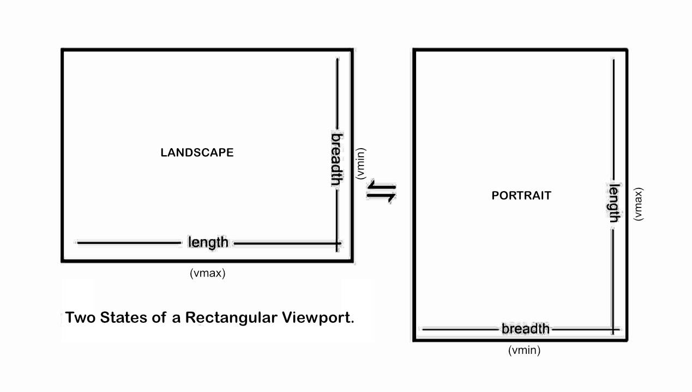

### An Observation 

We often use the terms `width` and `height` to specify the dimensions of an element. These labels, `width` and `height,` are almost second nature to the trade of sharing information about a component in web design. Knowing these terms is just as essential and fundamental as it is standardized.

However, by using these colloquial terms of web design, we also make an unwitting assumption: 

<!--truncate-->

> That the screen in front of the user is always vertical. 

While this was true back in the day, in the desktop era, when a monitor would sit on the desk, and the display would premise such usage. The viewport of a desktop was always on the vertical plane. 

But nowadays, in the 2020s, this assumption is no longer valid. One could lie on the bed, looking at their phone against the ceiling. Or one could be looking down at a phone while driving a car. 

Since the viewport of a handheld device is not restricted to displaying content along the vertical plane alone, usage of the labels `height` and `width` to reference its dimensions isn't the most ideal. 

These labels become invalid when the device is not held vertically.

### Better Labels?

Referring dimensions of an element or the viewport with the words `length` and `breadth` appears to work better. The labels remain valid no matter what the orientation of the screen is.

Also, we know exactly which side of the element is shorter because the label `breadth` specifies just that. It correlates better with the orientation of the viewport and has a direct relationship with viewport units like `vmin` and `vmax.` 

Well, they say, naming things is a hard problem. 
