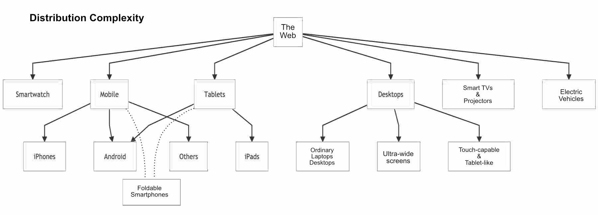

---

_This article was originally featured on the [The Bubblin Blog](https://bubblin.io/scrolls/blog). The literature posted below preceded the creation of the Toucaan framework originally._

---

### The Past.

In the past, like more than fifteen years ago, there used to be just one web. The desktop web. We used to design websites for interaction with the mouse. 

Do you remember (or did you ever hear of) the [960 grid](https://960.gs/) system? It was one of the latest and the greatest following the [YUI](https://clarle.github.io/yui3/). 

<!--truncate-->

Yes, it has been a long time since.

### The Receding Present

We got a new web in between. The mobile web. A web we could access while on the go. Smartphones have been the leading force behind the growth and kickstart of the mobile web. 

Tablets followed Mobile phones. Now we have a smart wristwatch with a solid web browser on it. We also have electric vehicles that are more of a device than anything else. The desktop monitor itself has evolved with ultra-wide and curved screens. Our phones can unfold into a tablet. 

And even the smart TV on the wall sports an excellent web browser, albeit only a few people know about it. It's _wild_.
Here are the devices that are on the web today:

1. The good ol' desktop.
2. Smartphones, of course.
3. Mini tablets & full-sized tablets.
4. Smartphones that unfold into a tablet.
5. Desktops with tablet-like capability (touchscreen).
6. Desktops with ultra-wide/gaming monitors.
7. Smartwatches.
8. Electric vehicles (like the Tesla Model 3/Y).
9. Smart TVs and projectors.

  

As you can see, the web is no longer just a simple desktop or mobile utility. It is a lot more than that. Even the desktop has new intrinsic controls beyond a pointer-driven interface. 

So how does this affect all of us?

### The Oncoming ~~Storm~~ Web.

To be clear, we can reach more people directly than at any time in history and do so wherever they are and in the moment. _And_, we can reach people in more ways than ever before. 

User expectations continue to rise while the tech is also slowly consolidating. I think a lot is happening at the same time. One can feel the pressure to deliver and give in to over-engineering easily. 

But our old and existing methods do not appear equipped to scale correctly on the new mediums. There are signs of [broken websites](https://dosgame.club/@MichaelKlamerus/110645309128259571) all over the old web, both in design and function. 

However, there is also good news. The limitation of what was possible on the web has [quietly disappeared](https://news.ycombinator.com/item?id=33033129). I think we are on a new edge of an exciting time to become a web developer and build new solutions from the ground up again. 

The new landscape of the web is like a new frontier, a giant canvas, a wilder, wild-wild west waiting to happen. All we have to do is get into the groove and solve. I am super optimistic.

### Design Systems & Accessibility 

As mentioned earlier, our existing design systems are poorly equipped for the new web. There are subtle differences in how people come across and access information on new surfaces. 

For example, the real estate on a smartwatch is barely an inch. Combine that with the low _viewing distance_ from the watch to the viewer's eye (which is just under a foot) and the fact that most users cannot hold their watch up longer than a few seconds at a time—and you'll know that the accessibility situation of a smartwatch is entirely different from anything we've seen or considered before. 

The reduction of UX and scale-up of UI for a watch are far beyond the limits of responsive design. We need new rules to deal with the design challenges at that level of miniaturization. 

:::info "The Scale of Web on The Apple Watch."
(Estimates vary, but Apple is said to be selling between [10 to 20 million](http://www.asymco.com/2017/09/25/a-small-screen-ipod/) watches each year, and all of the new ones sport LTE and a powerful webkit browser.)
:::

Another device to consider is an EV like the Tesla Model S. The car is web-enabled and sports a modern web browser with a desktop-sized display at the center of the vehicle's console.

But the web accessibility situation in an EV like the Model S is unique. 

One, the user is held back by a safety belt in the bucket of their seat. 
Two, the moving car limits access even more due to the need to focus on traffic. 
Responsive design systems do _not_ even consider such real-world situations. We probably need to discuss these ideas and perhaps add new guidelines for a more solid framework that addresses these issues.

We are in a new terrain altogether. The new web is very different from people on their computers or phones in the quiet of their homes. The new web is also more technically capable and challenging to build for.

While we may not be fully ready to exploit the potential of the new mediums, it is time to put our old methods away and start afresh.

---

