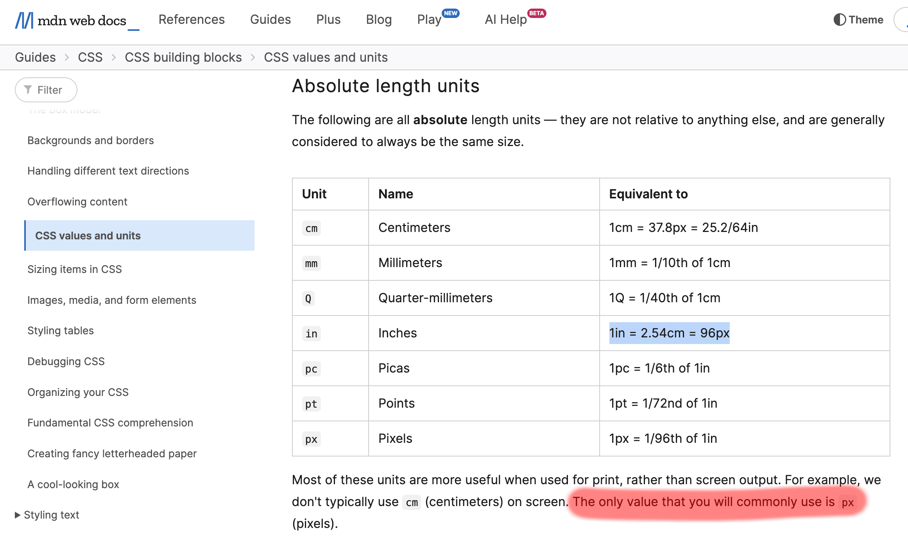

---

_This article was originally featured on the [The Bubblin Blog](https://bubblin.io/scrolls/blog). It has since been updated and migrated to the Toucaan blog because it is relevant here._

---

# The Standards Way

Have you ever tried using the [INCH](https://developer.mozilla.org/en-US/docs/Learn/CSS/Building_blocks/Values_and_units) css unit, i.e., `in`, in your web designs? No? 

Well, let's do it today. 🏁


I propose the following bit of code:

```css
/* Somewhere inside the <head> element of your page, add the following: */

@import url('path/to/portrait.css') only screen and (orientation: portrait);
@import url('path/to/landscape.css') only screen and (orientation: landscape);
```

<!--truncate-->

The css above will prioritize and import the desired stylesheet according to the orientation of the viewport. Then on the portrait (or landscape) css, we'll put the inch unit (`in`) to use like so:


```css
/* portrait.css */
@media only screen and (max-width: 2in) {
    /*  Style the smartwatch or tiny viewports with < 2" width. */
}
@media only screen and (min-width: 2.000000000001in) and (max-width: 4in) {
    /* Smartphones and phablets are usually < 4" in width.*/
}
@media only screen and (min-width: 4.000000000001in) and (max-width: 8in) {
    /* Tablets in portrait mode, perhaps…*/
}
/* and so on…*/

```
Do you like what you see? 

Wouldn't writing meaningful breakpoints like this be better? 

Doesn't the code above just read beautifully? Using breakpoints according to the physical size of the medium? Huh, who could have thought of that? 

I think referring to layouts by their physical size is only natural. It would also make it easier for developers and designers to communicate and reference UI with non-developer audiences. 

An inch-wide button. A footlong header. 🤠


I know, you must be thinking—but does it even work? Can we use physical inches on css like this? 

Well, the answer is both yes and no. 

:::tip The `--inch` Utility Variable
Checkout the documentation on the [--inch](./typography/introduction#case-of-physical-units).
:::

Note the `in` unit (css inch) used in the width-based media query above is _already_ offered by vendors as part of the specification. So _yes_, using `in` units like this is valid css. That's for the yes part. 

However, even though the code above is valid css and it "works" at the breakpoints specified predictably, the measurement doesn't scale the way we expect it to. 

Props if you have already spotted the bug in the code above! 

### A Brief Context
There has been an embarrassing and lingering issue with the web's equivalent of the inch since the early days. The problem stems from how vendors implemented (or could implement) the correlation between an absolute imperial or standard unit like the inch or centimeters _and_ the number of pixels it takes to achieve that physical length. 

In other words, css doesn't _really_ know how much an inch is.

Even modern browsers have this issue. A css inch, i.e., `1in` does not equal a real physical inch you and I know of and use regularly. Therefore, specifying  `width: 1in;` on your stylesheet doesn't mean the element painted on the DOM will be an inch-wide. Depending on the device, it would likely be shorter (or otherwise) than an inch in width.

A css inch (`in`) is something else altogether. It varies from device to device and has no reliable value despite the requirement. According to the specification, a css inch, i.e., `1in`, equals 96px (or 72px for the Mac) or 2.54cm. This mapping between pixels and inches was set (hard-coded) some 30 years ago based on the resolution of existing hardware then.

If we were to believe the original implementation, an Apple Watch would be four inches wide according to css. 384px / 96px ≈ 4in. But we all know this is false. An Apple Watch is just under an inch in width, even though its pixel resolution is close to the resolution of the original iPhone. 

:::info A Time Capsule
The last commit establishing the relationship between an inch and pixels, i.e., to 96px (or 72px on the Mac), was pushed in the early 1980s, during the age of CRT monitors. We're literally in a time capsule here! Can you imagine how long this bug has denied us the opportunity to use physical units for digital layouts? Almost four decades! 🔥
:::



The browser doesn't know how much an inch is in absolute terms. It never _tests_ for the actual size of the pixel rendered on the viewport. 

:::info  A 2011 Update of CSS Standards
"In the past, CSS required that implementations display absolute units correctly, even on computer screens. But as the number of incorrect implementations outnumbered the correct ones, and the situation didn't seem to improve, CSS abandoned that requirement in 2011. Currently, absolute units must work correctly only on printed output and on high-resolution devices." [Reference.](https://www.w3.org/Style/Examples/007/units.en.html)
:::

Yet, the committee did not define "high resolution" in its last update. Since low-end printers resolve at a minimum of 300 dpi, and high-end screens are close to 200 dpi in resolution today, the cut-off is probably somewhere in between. 

The note concluded with the following recommendation from the committee: 

"…if you are designing for print, use physical units (in/mm), but if you are designing for the online medium, use `px`, `em`, or percentages." 

But this was in 2011. More than a decade ago. 

What about now? Has anything changed in 2023?


# The New Way of The CSS Variables

Let's use one of the finest frontiers of modern-day css, [CSS Custom Properties or CSS Variables](https://developer.mozilla.org/en-US/docs/Web/CSS/Using_CSS_custom_properties) to teach some standard units to the browser. 

The good thing is that the browsers already know a little about it; we only have to bring them up to speed. Let's declare a variable `--inch` at the `:root,` like so:

```css
:root {
  --inch: 96px;
}
```
We start with the `in` to `px` mapping per the specs above. 

But I am writing this article on a 15" Retina Macbook Pro (2017). Since a retina(😬) display packs more pixels per inch than 96, the css inch, i.e., `width: 1in` on my computer, is shorter than the absolute measure. 

To add support for retina displays:

```css
:root {
  --inch: 96px;
}
@media (resolution: 192dpi) and (-webkit-device-pixel-ratio: 2) {
  :root {
    --inch: 130px; /* Tested using a physical ruler [^1] */
  }
}
```

Now the `--inch` utility variable specified on our layout will scale correctly. And it would do so on all the 20 million odd MBPs with the same hardware at best/default resolution. Yay! 🥳

We now have a better `--inch: pixels` mapping for a machine like mine. 

Notice that by using an inch: pixel mapping, we _inform_ the browser about how much an inch is in absolute terms here. We can continue to add hardware-specific `--inch: pixels` mappings for different mediums and combine those mappings with our existing knowledge of media queries to extend and refine further support.

For example:
```css
@media only screen and (min-width: 320px) {
  /* Small screen, non-retina */
}

@media only screen and (-webkit-min-device-pixel-ratio: 2) and (min-width: 320px), 
only screen and (min--moz-device-pixel-ratio: 2)      and (min-width: 320px),
only screen and (min-device-pixel-ratio: 2) and (min-width: 320px),
only screen and (min-resolution: 192dpi) and (min-width: 320px),
only screen and (min-resolution: 2dppx)  and (min-width: 320px) { 
  /* Small retina screen that overrides the mapping above */
}

/* and so on…*/
```

That's it. 

With css custom properties, we can easily supply the necessary hardware-specific mappings to the browser and then use physical inches to do our layouts. It not only scales well but is also so much more readable.

Given that css is all about finding a compromise to serve the maximum number of users, we can start, at least consider, using standard units for web design within an acceptable margin of error. Perhaps we may even reconcile the trade of print design and digital someday! 

I created a tiny [Utility Variable](https://github.com/Toucaan/--inch) called `--inch` that supports several commonly available devices. Feel free to submit PR to add new mappings if your hardware+browser combination isn't already included.

:::warn Disclaimer
Now it's time to state the obvious: As far as disclaimers can go, I must explicitly state here that this article and its accompanying library is an exploratory exercise. It is probably not fit for use in production yet. 
:::

[^1] I tested it using a [5th Grade Ruler](https://www.amazon.com/hand2mind-Flexible-Safe-T-Plastic-Beginner/dp/B01J8K0ZS4/ref=asc_df_B01J8K0ZS4/). 🥳

