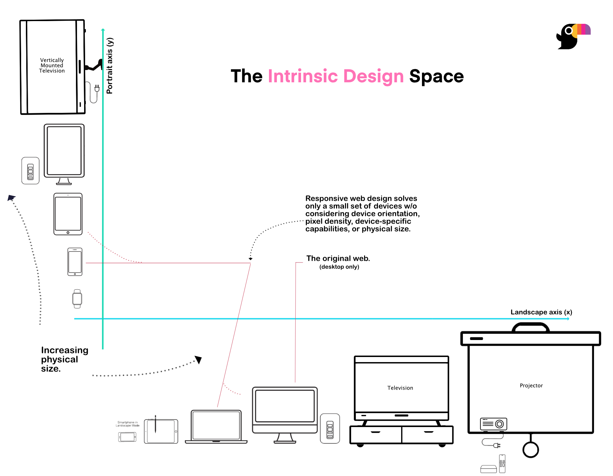

# The Design Space

Toucaan is an Intrinsic Approach to Design. It allows creation of interfaces that exploit the intrinsic capabilities of the medium. By designing "contextually relevant" experiences, the developer not only finds the right solution for a given medium but also they address the accessibility situation in a meaningful way. 

 
### The Axes of Intrinsic Design 

Toucaan's architecture is a simple implementation of the routes required along the [two axes of intrinsic design](/blog/intrinsic-design). 
Below is a plot of all the web-enabled devices plotted along the two axes in the increasing order of physical size. 

### How is it different from Responsive Design?

From the diagram above, one can see that the intrinsic space is considerably larger than the responsive one. Unlike with the responsive web design, the intrinsic approach uses a css router (see the [next chapter](router.md)) to separate stylesheets for various mediums .No hard-coded MQ breakpoints are used, for example. 

Intrinsic does not even consider mobile and desktop on the same axis of design. Mobile is on the `y-axis` of intrinsic orientation, whereas the desktop is on the `x-axis`, and therefore the designer is expected to work on desktops and mobile separately without having they mockups switched with a break point between the two. 

From the plot, it is easy to conclude that responsive design is all but one solution point in the overall design space of intrinsically capable mediums. 

### Is Toucaan a Design System?

Toucaan is not a single design system. It is rather a conventional css framework with handpicked lessons from several sources. Toucaan is a logical approach to the art of application design that is much better at scaling and easier to maintain over the years.

Read more about intrinsic design and the core-concepts of [a css router](https://bubblin.io/blog/a-css-router) for an in-depth analysis. 

Open `space.md` (this page) and edit some lines: the site **reloads automatically** and displays your changes.