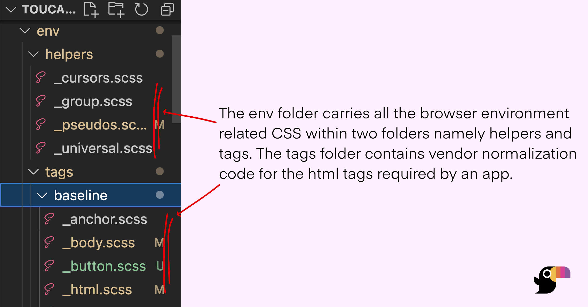

# Environment Variables

Sprinkling css into an application is like setting **Environment Variables** on the client side for your app to render correctly. To do so, one must understand the context of the viewport and the underlying capabilities of the device to get to the best frontend experience. 

Toucaan makes it easy to configure and deliver a _fully realized_ browser client environment with appropriate settings for your app. It separates the available stylistic choices according to the (industrial) category of the device using a [css router](./core-concepts/router.md), and allows you to manage the desired experience from one place.

### Vendor Normalization

The first soft layer of setting up environment variables for your application is handling the vendor inconsistencies up and close. 

Traditionally, applications have required injecting a fairly stable reset, reboot, or normalize css before any other application styles could be included. 

Toucaan **does not use this** strategy. It uses the [baseline method](https://bubblin.io/blog/baseline-css) instead.

:::info Why no Normalize?
To follow the HTML vocabulary of your app. A to-do app, for example, will likely not require the block of normalization code meant for a `video` tag. Alternatively, one could shed unused css programmatically at the build stage, but such a set up would often lead to a lot of dead code within the project. Toucaan forces you to make this careful choice early on.
:::


### The Env Folder

Open the `env` folder inside `toucaan` submodule to reveal its contents:



Inside the `env` folder you'll find two subfolders named `helpers` and `tags` each carrying a few initial defaults. Only a few baseline tags and pseudo-classes are included in the environment by default but you can add more into the context as needed. 

:::tip HTML vocabulary
The `env` must carry all the vendor normalization code according to the actual HTML vocabulary of your app. 
:::


### Desktop's Case

This is how the environment for a desktop browser is _reset_:

```css title="Open ./toucaan/app/desktop/desktop.scss"
/* Notch handling isn't required on desktops. */
/* @import '../../accessibility/notch';  */

/* ~ Other css and typeset defaults might come here */

/* Notice the first Environment Variable. */
@import '../../env/helpers/universal'; 

/* A baseline HTML environment. */
@import '../../env/tags/baseline/html';
@import '../../env/tags/baseline/body';
@import '../../env/tags/baseline/anchor';
@import '../../env/helpers/pseudos';

/* and so on… */
```

Take a look at the `desktop.scss` file to see a [real desktop reset](https://github.com/Toucaan/toucaan/blob/master/app/desktop/desktop.scss) followed by the space for application styles to be written by you.

:::tip
A desktop displays along the landscape-axis of intrinsic design, whereas a mobile on the portrait-axis. 
:::


### Mobile's Case 
Like with the desktop, the environment of a mobile browser can be set like so:

```css title="Open ./toucaan/app/mobile/mobile.scss"
/* Read more about the notch → https://bubblin.io/blog/notch */
@import '../../accessibility/notch'; 

/* ~ Other css and type defaults here */

/* Notice the first Environment Variable. */
@import '../../env/helpers/universal'; 

/* A baseline HTML environment. */
@import '../../env/tags/baseline/html';
@import '../../env/tags/baseline/body';
@import '../../env/tags/baseline/anchor';
@import '../../env/helpers/pseudos';

/* and so on… */
```

:::tip
Since most developers and designers like to work on a desktop, Toucaan recommends to **configure the desktop environment first**. Not mobile or mobile-first! 
:::


### Head Level Configuration
A part of the configuration options provided in the `_config.scss` file (see the [last chapter](./configuration.md)) are also environment properties. 

Here are some of the things for you to configure:

1. Decide on a color palette, 
2. Choose the right typeface(s), 
3. Host the type yourself or use a service, 
4. Apply initial defaults for common tags (or use the one provided), 
5. Choose a selection color in active and inactive states, 
6. Configure behavior and accessibility of form elements, and so on… 

The key here is to break it down into small piece and config the framework as you go on to build intrinsic UX/UI for each device category that you end up supporting for your users. Contextualize properties like `touch-action: auto` and `pointer: coarse` according to the need of the medium and move them out of the way from environments that do not require those.

Go to the next chapter on [Intrinsic Typography](./typography/introduction.md).
