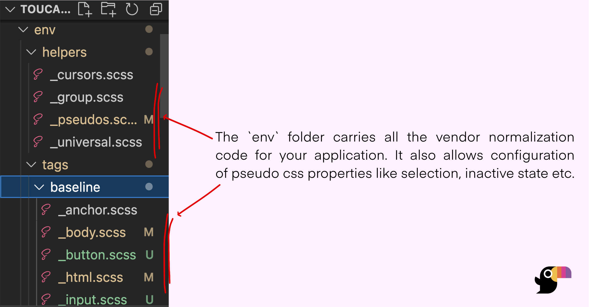

# Environment Variables

Toucaan considers sprinkling css into the mix is like setting up the **environment variables for your app to render correctly on the client side**. It's a part of the responsibilities that a frontend developer must bear. While this may sound like a powerful thing for the developer to lift, the sheer number of options available to configure each time makes it a formidable task.

With Toucaan you can organize and manage _all_ of the environment related possibilities from one place.

## Vendor Normalization
Vendor inconsistencies form the first soft layer of environment variables that your app must configure. Unlike other css frameworks, Toucaan doesn't use a brute force `reset` or `normalize` to bulldoze the browser. 

**Toucaan uses the [baseline method](https://bubblin.io/blog/baseline-css) instead.**

Expand the `env` folder with your Toucaan submodule. Inside you'll see two subfolders named `helpers` and `tags`, each carrying some default styles for a few `html` tags and `psuedos` that most applications require. 



You can customize each according to the vocabulary of your app.

### Desktop example

This is how the environment for a desktop browser is set:

```css title="Open ./toucaan/app/desktop/desktop.scss"
/* Notch handling isn't required on desktops. Delete the line below: */
/* @import '../../accessibility/notch';  */

/* ~ Other css and type defaults here */

/* Notice the first Environment Variable. */
@import '../../env/helpers/universal'; 

/* A baseline HTML environment. */
@import '../../env/tags/baseline/html';
@import '../../env/tags/baseline/body';
@import '../../env/tags/baseline/anchor';
@import '../../env/helpers/pseudos';

/* and so on… */
```

:::caution
Remember that the desktop browser environment usually falls on the landscape axis of intrinsic design, whereas the mobile environment would fall on the portrait axis.
:::


### Mobile example
Similarly, the environment of mobile phones is set like so:

```css title="Open ./toucaan/app/mobile/mobile.scss"
@import '../../accessibility/notch'; 

/* ~ Other css and type defaults here */

/* Notice the first Environment Variable. */
@import '../../env/helpers/universal'; 

/* A baseline HTML environment. */
@import '../../env/tags/baseline/html';
@import '../../env/tags/baseline/body';
@import '../../env/tags/baseline/anchor';
@import '../../env/helpers/pseudos';

/* and so on… */
```

:::tip
Start small with just desktop environment initially. Take it a step further to supporting mobile next, and so on until you cover the remaining scope of Intrinsic Design.
:::

## Configuration
In the last chapter we were introduced to the `_config.scss` file that Toucaan requires to link stylesheets with the app's HTML.


Break down your default styling strategy into smaller device-compatible units that are uniquely configurable. For example, handling the notch on a few common smart phones isn't a concern for the desktop css. 

## Color Palette
Decide on a color palette, choose the right typefaces or host a font-family yourself, typeset with a few sane initial defaults, paint a selection or inactive state color–there are so many css configurations possible! 

## Inline Documentation
Toucaan's [submodule](https://github.com/Toucaan/toucaan) comes with in-line documentation throughout in order to help you configure the css of your application easily with proper understanding. Questions or contributions on the same are most welcome.
