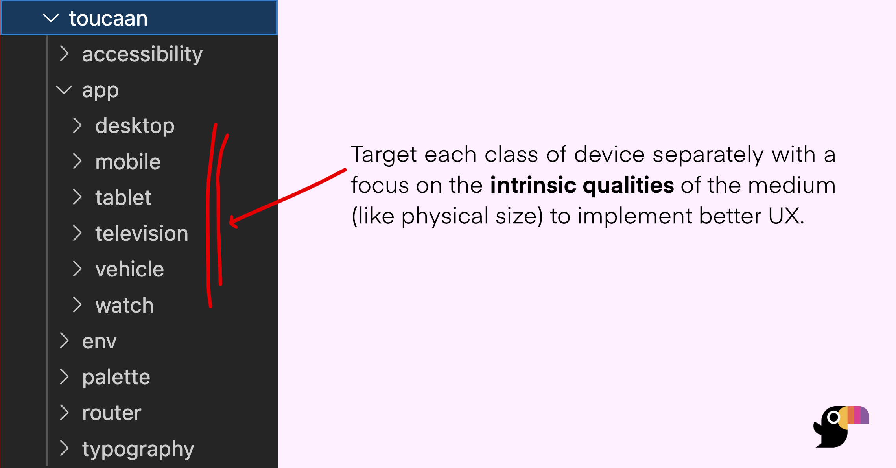

# Overview

Here is what the folder structure looks like once checked out: 



Toucaan will organize all of the css required for your application within its framework folders. There is no separate `normalize`, `reboot`, or `reset` that exists elsewhere and is imported into the application.

```bash
project-root
├── toucaan
│   ├── accessibility
│   │   ├── _darkmode.scss
│   │   ├── _notch.scss
│   │   └── _reducemotion.scss
│   ├── app
│   │   ├── desktop
│   │   │   ├── components
│   │   │   │   ├── _hero.scss
│   │   │   │   ├── _form.scss
│   │   │   │   └── Other style files.
│   │   │   ├── layout
│   │   │   │   └── _layout.scss        /* Desktop specific layout. */
│   │   │   └── desktop.scss
│   │   ├── mobile
│   │   │   ├── components
│   │   │   │   ├── _hero.scss
│   │   │   │   ├── _form.scss
│   │   │   │   └── Other style files. 
│   │   │   ├── layout
│   │   │   │   └── _layout.scss        /* Mobile specific layout, and so on…*/
│   │   │   └── mobile.scss
│   │   ├── tablet
│   │   ├── television
│   │   ├── vehicles
│   │   └── watch
│   ├── env
│   │   ├── helpers
│   │   └── tags
│   ├── palette
│   ├── router
│   ├── typography
│   └── utils
```

### Brief Explanation

Toucaan implements a simple architecture to cover the [**entire design space**](space.md) of [the new web](https://bubblin.io/blog/the-new-landscape-of-the-web). There are several new types of devices connected to the web today and mobile responsiveness approach _isn't_ enough anymore.  

Learn about the **Intrinsic Design Space** in the [next chapter](space.md).

Toucaan uses a [simple css router](router.md) to prioritize and load the correct stylesheet for the corresponding _class_ of device the user is on. This router will separate your stylesheets according to the types (or classes) of devices being served, and help you organize all your application CSS in the appropriate subfolders as shown in the [architecture](#the-architecture) above.