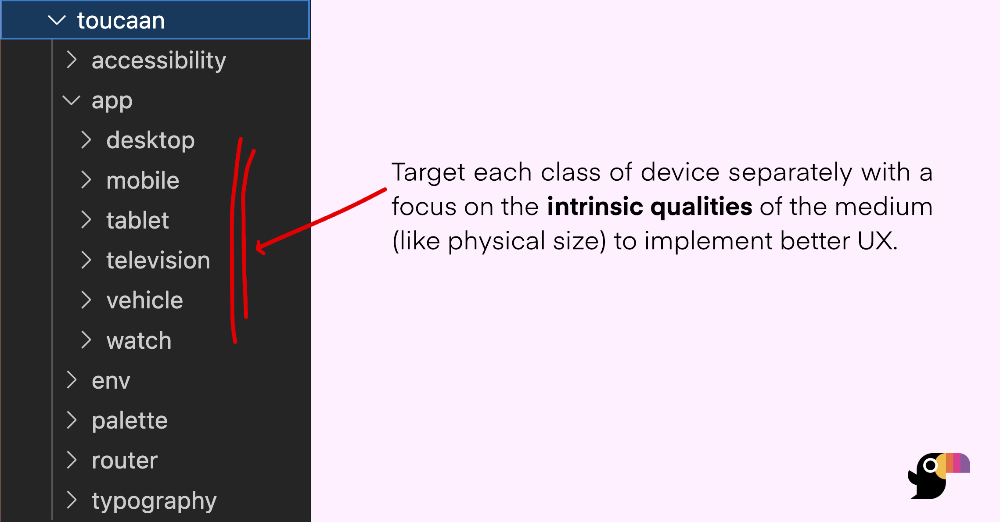

# Quick Introduction

Let's discover **Toucaan in a few minutes**.

## Getting Started

**Create a new folder `toucaan`** in your project as follows. Run the following command:

```bash
mkdir -p toucaan/{accessibility,app/{desktop,mobile,tablet,vehicle,television,watch},env/{helpers,tags},palette,router,typography,utils}

```

### Architecture

The `mkdir` command above will create all the folders necessary for you to start working with [Toucaan](https://toucaan.com). These folders will contain _all_ of the css necessary for your application's multiple frontends. 



Learn more about the complete design space in the [next chapter](space.md).


Open `intro.md` (this page) and edit some lines: the site **reloads automatically** and displays your changes.