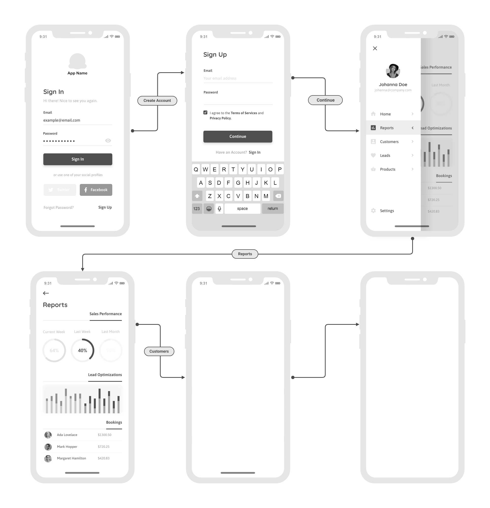

# Introduction
Toucaan makes it possible to create "app-like" layouts for mobile apps using plain old HTML and CSS. 

The central theme of [intrinsic design](https://toucaan.com/blog/intrinsic-web-design) is to create user interfaces that "belong to" a device, and what better way for an app to belong to a mobile than by making its user experience feel truly app-like. 

### Mobile App Workflow

A simple workflow with a minimum set of features is the way to go. 

