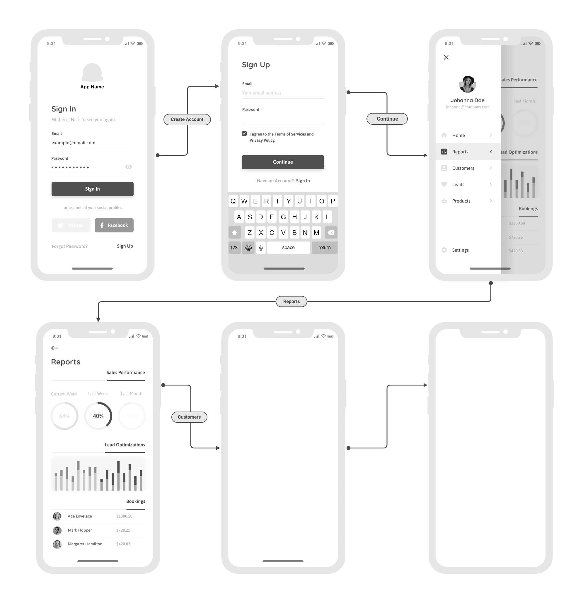

# Introduction
Toucaan makes it possible to create "app-like" layouts for mobile and desktop apps. Use plain HTML and CSS to create screens for your _native_ mobile app and navigate between them seamlessly using [portals](https://github.com/WICG/portals). 

This is an experimental region of Toucaan. And in part one of the core themes of [Intrinsic Design](https://toucaan.com/blog/intrinsic-design). 

### App Workflow

A simple workflow with a minimum set of features is the way to go. 

