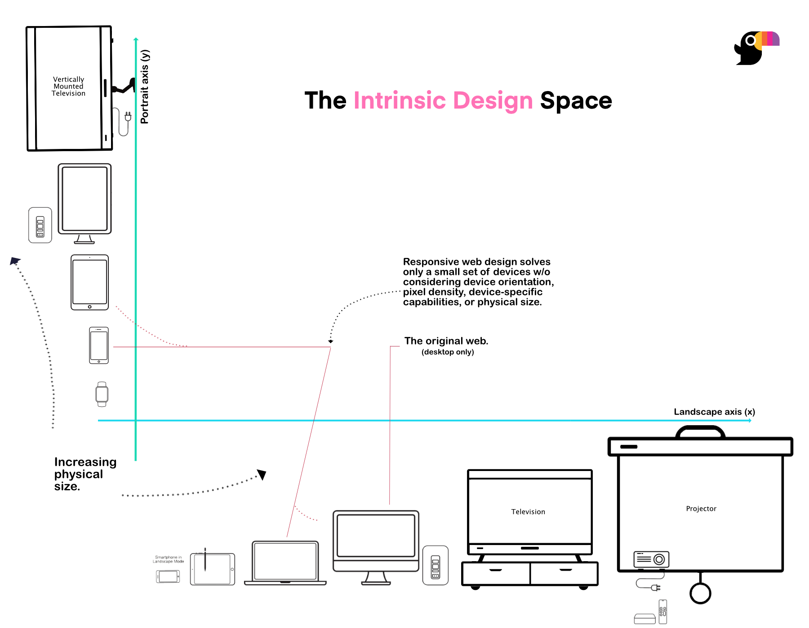

# The Design Space

The intrinsic approach to design caters to the needs of [the new web](https://bubblin.io/blog/the-new-landscape-of-the-web). It allows design and development of "contextually relevant" interfaces that exploit the capability and accessibility situation of different type of devices.

### The context
The design space of the new web has grown beyond just mobile and the desktop. Imagine interfaces that fit electric vehicles, foldable tablets, watches and much more.

### Axes of Intrinsic Design 

Toucaan's architecture is a simple implementation of the [intrinsic axes of design](/blog/intrinsic-design). Shown below is a plot of web-enabled devices along the two axes of orientation in the order of increasing physical size. 

Notice how the mobile (on y-axis) that is generally viewed in portrait mode and the desktop (on x-axis) that is generally viewed in landscape mode collectively form the backbone of responsive web design.

### Is it design system?

Intrinsic Design is considerably different from responsive One, it is not a single design system, but a set of design systems, each with their own set of rules and guidelines, fused into one scalable strategy that just works.

We encourage you to read more about the [intrinsic design space](https://bubblin.io/blog/a-css-router) to learn more about the axes of intrinsic design. Or take a look at the code of Toucaan's [intrinsic css router](https://github.com/Toucaan/toucaan/blob/master/toucaan/router/portrait.css) in the next chapter.

Open `space.md` (this page) and edit some lines: the site **reloads automatically** and displays your changes.