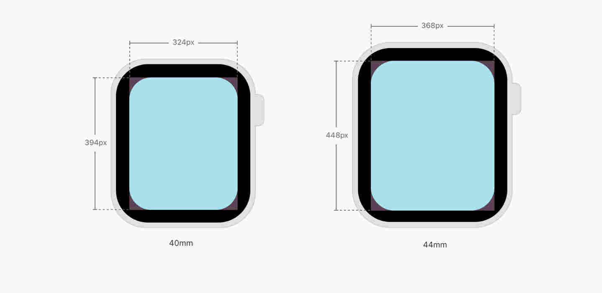
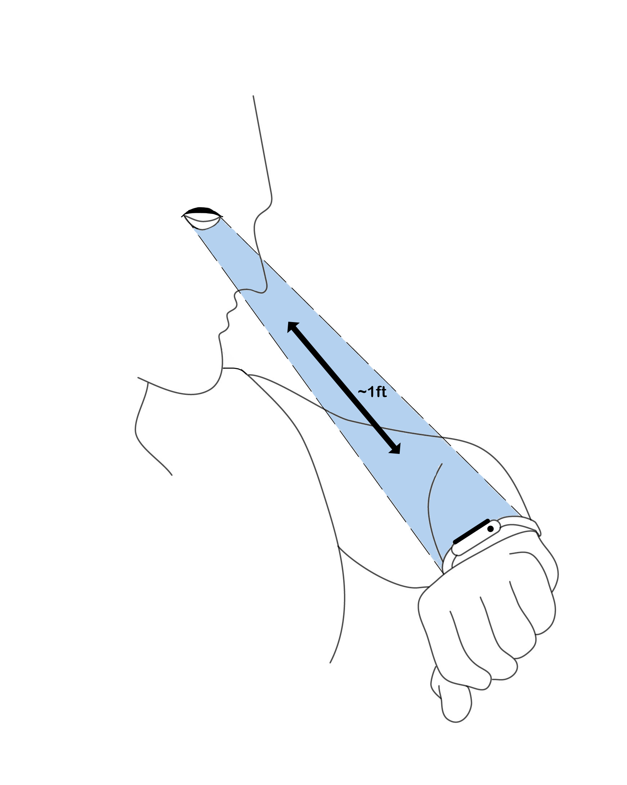

# Designing for the Watch


Designing for the tiniest form-factor on the web has a few unique challenges.

### 1. Extreme Minimalism

The first thing to internalize about an Apple Watch is that it is the _tiniest_ screen on Earth with a decent web browser (webkit). And yet, despite its small size, the resolution it comes in is similar to that of a smartphone. A petite Apple Watch, for example, is only 40mm in size, but it resolves to 324px x 394px. That's on the lower-end of width that a smartphone has in absolute pixels. 




Since all of your UX/UI is supposed to be packed inside a piece of glass that's just 1.57" long on its diagonal, extreme minimalism is the only way to go about it. 

- Display only one piece of information on the screen at a time.
- Use the full width of the Watch screen.
- Group similar elements together to help users find the information they want easily.
- Use circular buttons instead of squarish ones.
- Avoid use of complex controls for your app on the Watch.
- Content-heavy page should be left-aligned.


### 2. Only Portrait Mode

An Apple Watch lights up in portrait mode only (although this could change in the future). This means that we need only one stylesheet `watch.css` to support the only possible orientation of a watch on our css router.


### 3. Pixels Do Not Scale.

Resolution of a petite Apple Watch is only 324px x 394px. It roughly the same resolution as that of a first generation iPhone, but do not be
mistaken by this fact. Using pixels the old way to scale up content on an Apple Watch will almost certainly not yield an ideal outcome. If the element sizes are not gauged carefully, all of the UX/UI of your app could suffer from the "fat finger inaccessibility". 

The viewable area on the watch is only about 1.18" x 1.25", and, at
that level of physical size a pixel-based UI does not scale. In fact, the "light up" area on an Apple Watch is even smaller than 1.18" x 1.25" due to the rounded corners of a watch and because it is very easy for content to be obscured by the inner edges of the bevel depending on the viewing angle and viewing distance of the user.

Use `--fs` utility variable instead.

### 4. Short Viewing Distance => Shorter Attention Span 

Depending on user preference or eyesight, the viewing distance on an Apple Watch is typically between 7 to 12 inches from the face. As opposed to that a smartphone is normally viewed from over a feet and a half away.




In general, optimize for both short viewing distance and short attention
span. Use a large font-size to present minimum set of functionality to the user. Allow `pinchzoom`, even if the content is typeset in large.

### 5. No Web Fonts

Avoid using Google Fonts or any type of hosted typography for the watch. Toucaan recommends use of `system fonts` for web applications on the watch. 

```css
/* Use system fonts. */
body {
	font-family: var(--system);
}
```

Interestingly, Apple [recommends](https://developer.apple.com/design/human-interface-guidelines/watchos/visual-design/display-sizes/)
using relative sizing and dynamic type to ensure that the items expand or contract naturally to fit the available space. This is great
because we do just that with [blockscoped typography](../typography.md)!

### 6. The WatchOS Meta Tag

To take control of how your website will appear on the Apple Watch, add the following meta-tag to the head of your webpage:

```html
<meta name="disabled-adaptations" content="watch">
```

With this meta-tag, WebKit will know that it doesn’t need to scale your content down and will render the page according to how you instruct it to. Apple recommends to display content just as you'd do on your mobile phone, regardless of the display size. This is exactly how mobile web used to be scaled initially, before the advent of responsive web design. 

While this recommendation from Apple is likely to work okay for the most part, it is far from ideal because even the mobile UX/UI can be fairly complicated for a user on the watch.

Note, without the meta-tag above, Apple will scale down your mobile-fitting content by factor of 0.49 to fit it _as is_ onto the watch, without triggering reflow or the horizontal scroll.


### 7. No Service Worker API

No PWA. Apple Watches do not support the Service Worker API, so there is no possibility of 'offline-first' enhancement for the watch. In fact, it is recommended to keep javascript to a minimum. Avoid using heavy front end libraries like React, Nextjs, or Vuejs that may exhaust the small resources of watch too quickly like the battery. 

### 8. No Inline Video Playback

There is no video support on the Apple watch at this time.

### 9. Handling Images

Use a single autoscaling image with 100% width for the watch screen. Multiple versions of the same image will require more space and is, therefore, not a recommended approach for the watch.

```HTML

```

### 10. Form Handling and Accessibility

Unless absolutely necessary, avoid form submission over the watch. Some form elements have been designed specially for the watch by Apple. For example, the Apple Watch supports number (`type="tel"`), date (`type="date"`), and select (`<select>`) type of form inputs. Using these aria-labels will inform webkit to provide the right kind of interface to the users.

As expected of a tiny screen, the form controls move the screen into fullscreen mode at each input. This means that it is important to label your form elements correctly and have the appropriate ARIA roles attached to the fields so that users know what they’re doing while filling up the form.


### 11. Conclusion

Now that you understand the Apple Watch better, you can design a better looking and a more accessible page with Toucaan for your users. Go for it!

---
